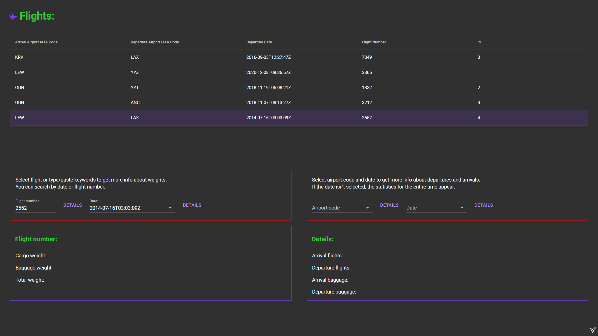

## Screenshots

### Running the application from the command line.
1. If you don't have, you need to install it node.js >>> [https://nodejs.org](https://nodejs.org)
2. Open command prompt in `airport/jsonserver` directory and execute `npm install` command.
3. Execute `npm start` to start json server with data needed to run application.
4. Open another command prompt in root folder where `pom.xml` file is located.
5. Execute `mvn spring-boot:run` to start application. It will start on `http://localhost:8080` .
6. Enjoy!